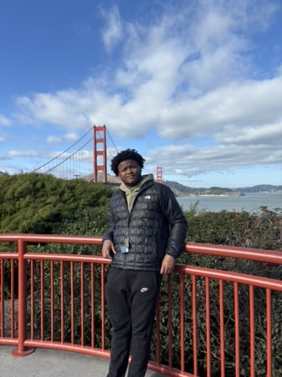

# How to Work with Daniel Boyce

### My work Hours:
I am typically an early riser I like to wake up at 6 in the morning to start my day. I walk my dog and make breakfast. I don't like to start my morning with work usually relaxing things like walking reading, or getting some fresh air. My work hours are usually from 8:15 6:30 or later if I procrastinate.

### What's the best way to communicate with me
Best to get to me is to use text, email, or discord. I generally prefer to talk in person or over zoom if we are out of work. if I dont get back to you trying messaging me through our google meet or text

### I'd love to help ___
Anything I can if you need help just hit me up 
### What makes me grumpy?
I dislike micro managning, I prefer to get a basic rundown of a task then let me come with any questions or etc. I also dislike working in groups with overly quiet or unresponsive group members.
### How do I like to receive feedback?
I like feedback with actionable outcomes that can give a clear picture of what needs improvement. Also be respectful
### My goals for the coming year
Get a tech job, also lose 10 more pounds

### Hobbies and Interests
I love the gym, fitness and sports, video games, reading, and watching shows or movies

- Other Things
    - Favorite Foods: Steak, Salmon, Pasta, and Brownies
    - Siblings/Pets: 2 brothers 3 sisters, 1 dog and cat
    - Sports Loyalties: Eagles, and Chicago Bulls
    - My Hometown: Wilmington DE
    - My Birthday: 11/16/2002

## Photo Gallery

