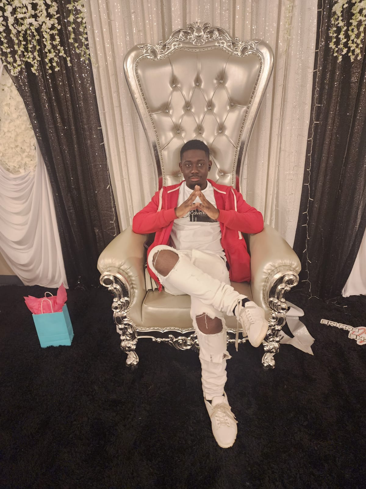
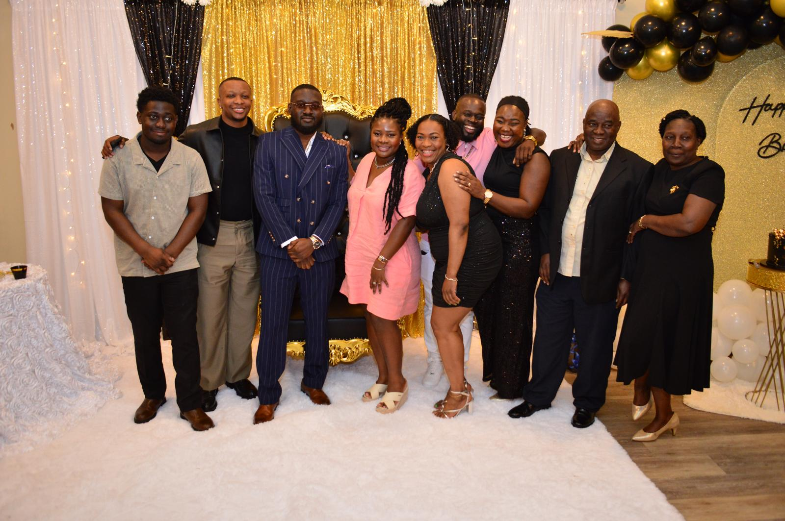

# Danielson Adjocy README

## Introduction

Danielson is a recent college graduate from Delaware State University in the city of Dover, Delaware. There he studied Computer Science for four years and now he wants to get a job in either data science or in software engineering. Work experience includes internships in project management for both Bank of America and Delmarva Power as well as tutoring computer science at Delaware State. 
## Origin
* Family is from Haiti.
* Self born in Brevard County, Florida.
* Raised in Dover, Delaware.

## Bootup
1. Wake up for the day after the third alarm.
2. Take care of hygiene, change clothes and make myself presentable.
3. Prepare both breakfast and lunch for the day.
4. Optional: Buy Coffee to me not fall asleep in the morning.
 if Staying_home():
     &emsp;5. Set up my desk and make sure everything is clean.
     &emsp;6. Get to work.
 else:
     &emsp;5. Drive to my destination while listening to music or audio books.
     &emsp;6. Begin my day.

## Expertise
As I said before, I am mostly into data science and software engineering.  With data science I mostly have experience coding with machine learning and displaying data in different forms and graphs. As for software engineering, I am most comfortable in front end design particularly in Javascript using React or React Native. I do however, have some backend experience in modeling relational databases and making them using SQL and Python. Thanks to tutoring and my time at college I have plenty of time working in a group to accomplish a task, both with peers and while trying to help others with their needs.
## Links
Contact time: Usually available at any time but most availability will be during the afternoon and evening. Email is the best contact method.
 Code differently gmail: dadjocy252@gmail.com
 LinkedIn: https://www.linkedin.com/in/danielson-adjocy-832a9a188/
 Github: https://github.com/DaFDE31?tab=repositories

## Fun Facts
* Started coding in high school in AP Class
* Label: Jack of all trades
* Favorite Color: Red
* Favorite Passtime: Completing video games 
* Favorite Show: Dragon Ball
* Currently watching Jojo's Bizarre Adventure

## Photo Gallery

