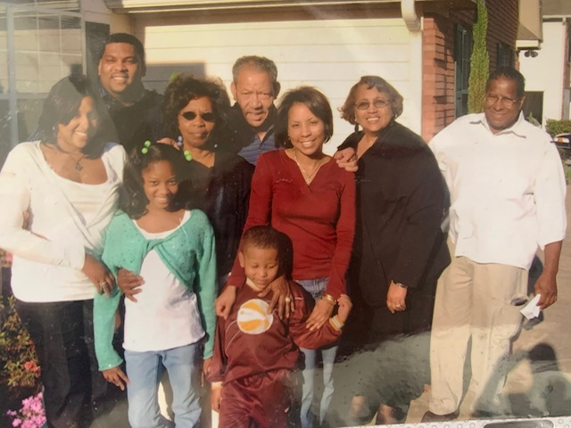
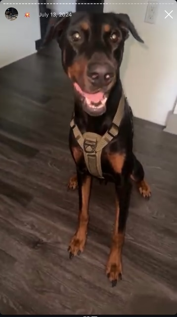
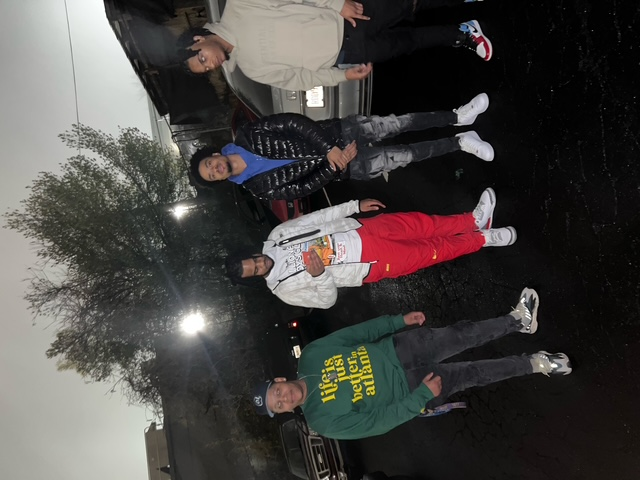
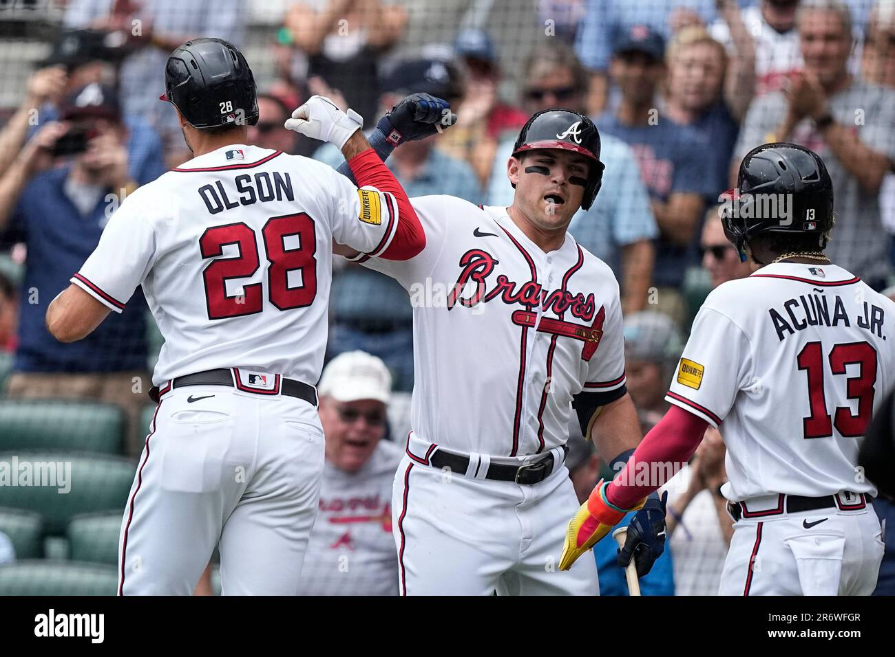
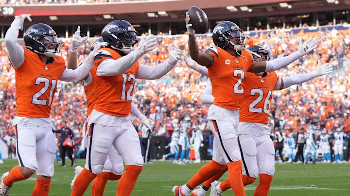
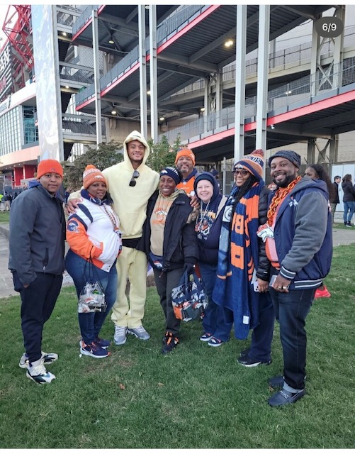
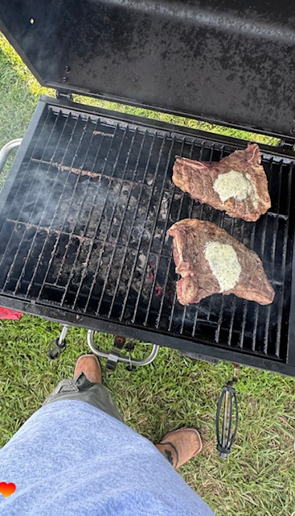

# Dean A.H. Walston README

## 🧭 Introduction

I'm a proud graduate of **Fisk University** (Nashville, TN), born and raised in **Atlanta, GA**. Passionate about leveraging technology to solve real-world problems, I’ve worked at:

- 🏢 Rocket Mortgage / Quicken Loans  
- 🤝 The 100 Black Men of Atlanta, Inc. 
- ♻️ The Recycling Partnership  

Currently, I’m a full-time learner at **Code Differently**, developing both **technical skills** and **professional soft skills** to make a lasting impact in my community.

---

## ⚙️ My Development Preferences
Essential thing and values I need to be productive and impactful.

### 🧠 Learning Style
- 🛠️ Hands-On Learning (prototyping, building, workshops)
- 🤝 Social Learning (peer collaboration, mentorship, group projects)

### 🧩 Skills in Progress

#### Hard Skills
- 💻 Coding 
- 📊 Data Analysis
- 🌍 Foreign Language Proficiency (in progress)

#### Soft Skills
- 🧭 Time Management
- 📣 Help-Seeking & Communication
- 💰 Budgeting
- 📈 Career Growth (Certifications, Sustainability Practices)

### 🎯 What Keeps Me Focused
- Clear learning goals & measurable milestones
- Real-time feedback & regular check-ins
- Purpose-driven learning with community impact

---

## 🌿 Recovery-State Strategy

**A healthy mind drives a healthy workflow. Here’s how I recharge:**

### 🔋 High-Energy / Social Recharge
- 👨‍👩‍👧‍👦 Spending time with friends and family
- ✈️ Weekend travel
- 🤸‍♂️ Community events (festivals, pop-ups, group fitness)
- 💪 Volunteering and service work

### 🔧 Moderate-Energy Recharge
- 🔥 Grilling (specializing in beef, chicken, salmon, etc.)
- 🧑🏾‍🤝‍🧑🏾 Local community engagement

### 🧘‍♂️ Low-Energy Recharge
- 🎧 Music:  
  - Genres: Hip-Hop, R&B, and genre exploration  
  - Current Playlist: Starts old school, ends with new age  
  - Artists on repeat recently: **Boston Richey, Loe Shimmy, Don Toliver, PARTYNEXTDOOR** 
- 📺 TV & Movies (Action-focused binge marathons)
- 📚 Reading, meditation, and praying
- 🏈 Watching sports
---
## 📫 Connect With Me
### What’s the Best Way to Communicate With Me?

- 💬 **Quick Chat / Day-to-Day:**  
  Google Chat, Text Message, Zoom/Google Meet (preferred for internal communication)

- 📧 **Detailed or Non-Urgent Matters:**  
Email — I typically respond within 24 hours  
  `dwalston252@gmail.com`
- 💼 [LinkedIn](www.linkedin.com/in/dean-walston-663b1b14a)  
---

> “Change doesn’t happen overnight — but with the right tools, the right mindset, and the right community, it’s always possible.”

## Photo Gallery

### 👨‍👩‍👧‍👦 Family & Life

###  Favorite Sports Teams ⚾🏈

###  🍖 On the Grill, Tailgate Vibes

