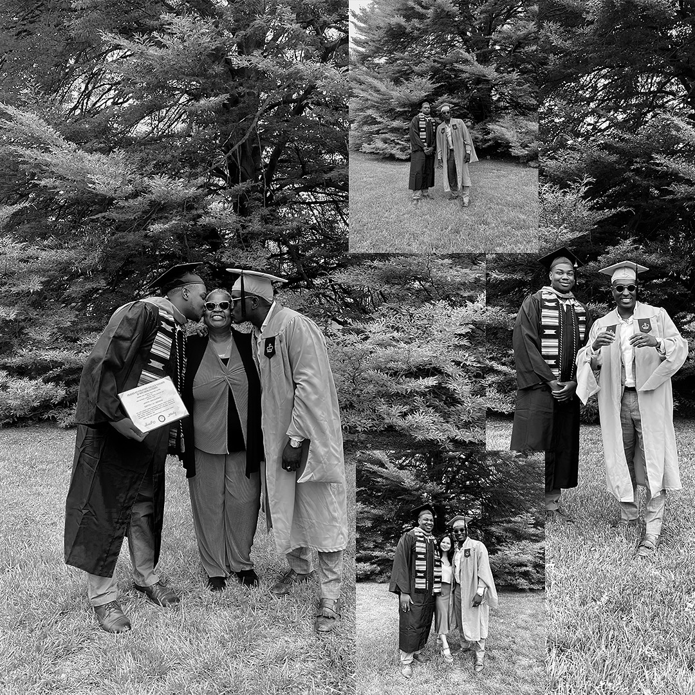
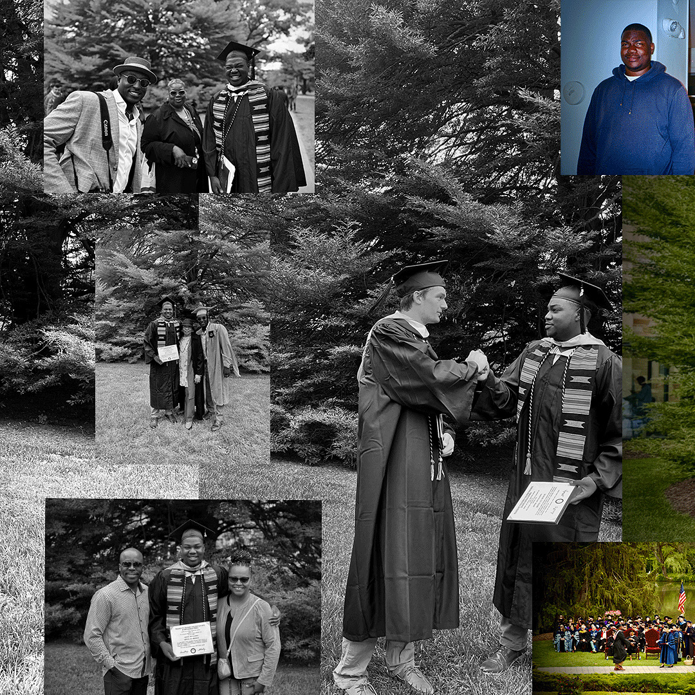
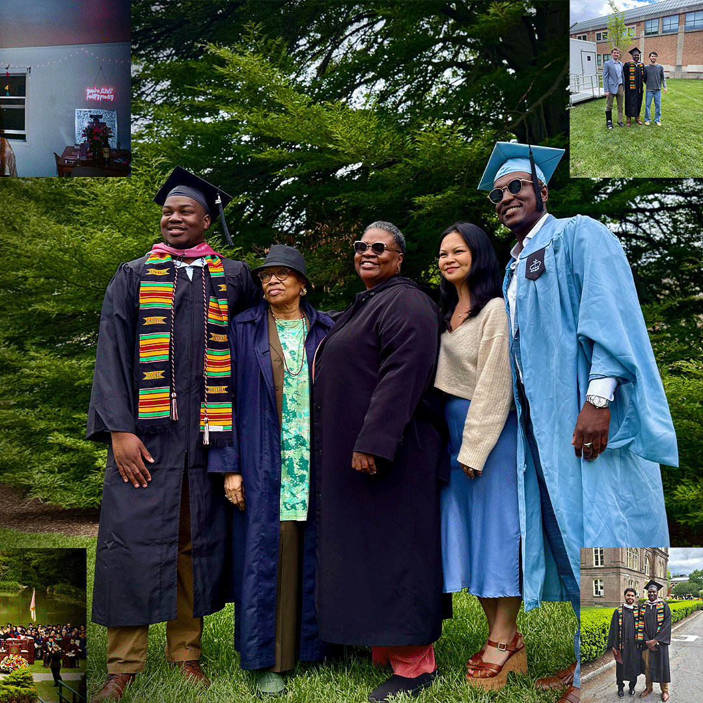

## Devyn Benson

### My work hours:
I typically start my days with course work, training, or watching videos/podcasts, whether that's a morning/evening workout, diving into more knowledge in tech, or staying up to date with NBA/NFL/NCAAF/NCAAM. My working hours for technical tasks are usually **9:00 AM–5:00 PM ET**, I'm most responsive to Slack **dxbenson252@gmail.com** and email as well (**dxbenson252@gmail.com or bensondevyn@gmail.com**). Early mornings and late evenings are often filled with classes, working (lifting or grinding on the computer), hanging with friends, and spending time with family. When I'm on break or if something urgent comes up outside of these windows, reach out and I'll respond as quickly as I can.

### What’s the best way to communicate with me?
I prefer Slack for quick questions and routine updates. If your message requires detailed context or attachments, send me an email and I'll make time to respond thoughtfully. For brainstorming or complex discussions, I’m a big fan of in‑person or video chats — they help build understanding and camaraderie. If I don’t get back to you right away, a follow‑up email or Slack ping is absolutely fine; when I'm travelling, working, or networking at events, notifications can slip through.

### I’d love to help you with …
Thanks to my Computer Science coursework and professional experience, I’m excited about:

- **Building and refining full‑stack systems** using Rust, Python, C, Java and other languages.
- **Developing automated tests and human‑centered API documentation**.
- **Planning and executing events**, from brainstorming and budgeting to volunteer coordination and partnership outreach.
- **Mentoring others on leadership, communication skills and academic success**.

### What makes me grumpy?
Ambiguity and disorganization. I thrive on clear goals and well‑structured meetings; repeated indecision or last‑minute changes make work harder for everyone. I also believe in being on time — whether that's a meeting, a deadline, or a basketball game (I used to be an athlete 🏀)
### How do I like to give feedback?
For big‑picture topics like project direction or career growth, I prefer to talk face‑to‑face or via video to ensure we’re on the same page. Smaller items often get captured in comments or quick Slack messages, and I try to document to‑dos in shared project tools so they don’t get lost. Celebrating wins is important, so expect to hear from me when things go well!

### How do I like to receive feedback?
Anytime, in any format. Slack or email are totally fine if that’s most comfortable, and written feedback is helpful for me to refer back to later. I appreciate honesty and timeliness; addressing issues early helps me improve and keeps projects running smoothly.

### One of my goals for the coming year:
I'm heading into life post graduation, so now after completing my Computer Science BA, I intend on deepening my software engineering expertise, growing network, and getting into the tech industry are my top priorities. As I am in this transition I continue to seek a full‑time tech engineering role or dat analytics role after graduation.

### Topics I’m always happy to talk about:
Video games, algorithms, tech mentorship for under‑represented students (or mentorship for men and womeen of color), community engagement, sports strategy and analytics, and full‑stack development best practices.

### Other things you might want to know:

* **Major & Graduation:** Computer Science, expected May 2025.
* **Technical Skills:** Rust, Python, C, Java, C++, Google Cloud Platform, APIs, R and HTML.
* **Leadership & Service:** Assistant Director of Senior Events at Vassar, Leadership and Facilitation Fellow with Brothers@ mentoring program, and Captain of the Men’s Basketball Team.
* **Volunteer Work:** Malcolm X Park Spring Cleanup Initiative and Back‑to‑School Co‑Ed Summer Camp.
* **Extracurricular Interests:** Basketball, Community Mentorship, Student Advocacy, Bowling, Darts, Lifting, and Board/Card Games

<a href="https://www.linkedin.com/in/devyn-benson-79854121a/">LinkedIn

<a href="https://github.com/dev-benson-03">Github

<a href="https://app.joinhandshake.com/profiles/nxqchh"> Handshake

<a href="https://www.instagram.com/_devyn.b_/">My IG

