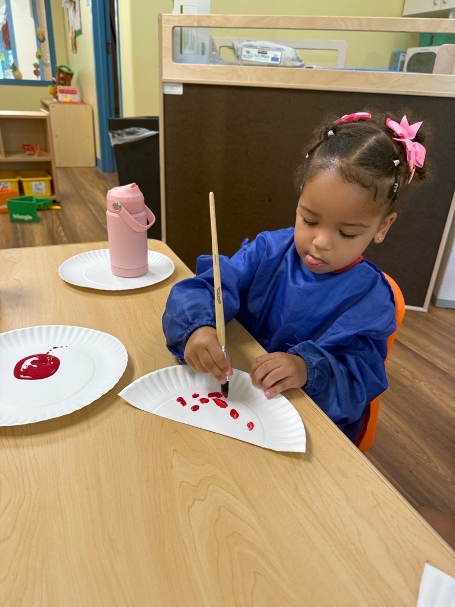
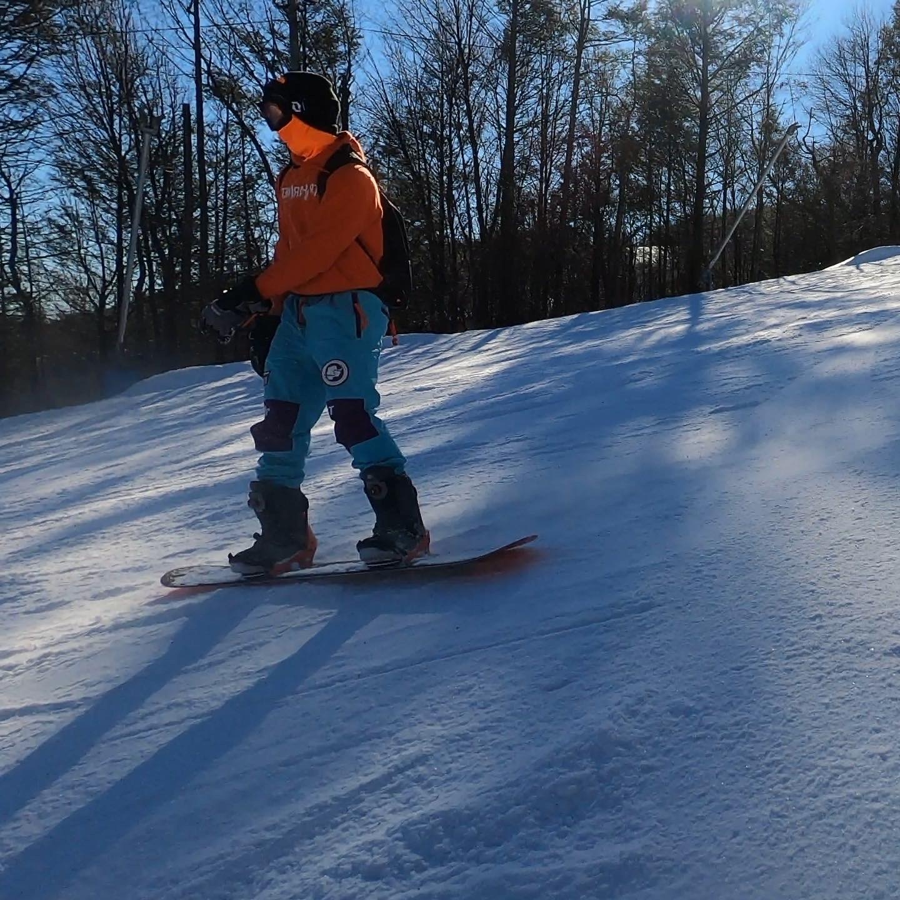
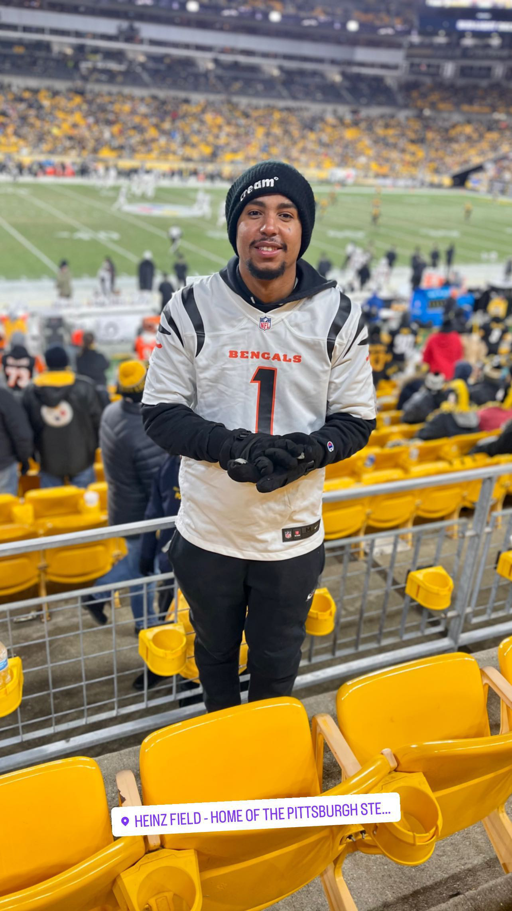

## How to work with Jaizel Cespedes
This document is meant to give colleagues a quick rundown on my work preferences, and some context about my life. 

### My work hours:
My life usually revolves around work. I have my phone on me from the time I wake up until I go to sleep, so I’m generally easy to reach throughout the day. I usually wake up early and go to sleep by 10:00 pm, which gives me a long window to stay productive and responsive.

### Are you a morning person? Or a night owl? 
I am more of a morning person. I typically begin my day at 5:00 am, which gives me a head start on planning and getting organized. Mornings are when I feel the most focused and energetic, so I prefer to tackle important tasks early in the day.

### What’s the best way to communicate with me?
The best way to communicate with me is through email. I check my inbox regularly and prefer it for more detailed or formal messages. It also helps me keep track of conversations and respond thoughtfully.

### If I don’t respond, try:
If I don’t respond to an email, the next best option is to send me a message through chat. I usually see chat messages faster and can provide a quicker response that way. Just a simple follow-up can help make sure nothing gets missed.

### I'd love to help you with:
I’d love to help you with any questions from past lessons. I enjoy reviewing material and helping others understand things more clearly. Whether it's refreshing a topic or going over something in depth, I’m happy to support you.

### How do I like to give feedback?
I like to give feedback in person. This allows the conversation to feel more genuine and gives the other person the chance to see my facial expressions and ask clarifying questions. I believe in open, supportive communication that encourages growth.

### How do I like to receive feedback?
I like to receive feedback in person and as often as possible. Frequent feedback helps me understand what I’m doing well and where I can improve. I appreciate honesty and constructive input that I can use to get better over time.

### One of my goals for the coming year:
One of my goals for the coming year is to get a high-paying tech job. I’ve been working hard to build my skills and expand my knowledge in this field. Achieving this goal would be a big step forward for both my career and my personal growth.

### Topics I’m always happy to talk about:
A topic I’m always happy to talk about is sports. I stay current with most major sports news and enjoy discussing games, trades, and predictions. My favorite football team is the Bengals, and I never miss a chance to talk about their latest performances.

### Other things you might want to know:
I have a two-year-old daughter who is a big part of my life. She keeps me on my toes and brings a lot of joy to my day-to-day routine. Balancing work and parenting can be a challenge, but it's also incredibly rewarding.

### Things I love to do outside of class:
Some of my interest include:
- **Snowboarding** I love the feeling of snowboarding, especially the rush of cold air hitting my face as I carve down a mountain. It’s one of the few activities that completely clears my mind and keeps me in the moment. Every run feels like a new challenge and an opportunity to improve.
- **Vacations** I enjoy exploring new places, whether it’s a weekend trip nearby or a longer journey far from home. Traveling helps me reset and see life from a different perspective. I'm always excited to discover new cultures, foods, and experiences.
- **Off-Road** The adrenaline of going through a tough road in the middle of nowhere is something I really enjoy. Off-roading pushes both my vehicle and my skills to the limit, and that challenge is part of the fun. There’s also a sense of freedom and adventure that comes with being far from the main road.
- **Motorcycle** Riding a motorcycle is incredibly relaxing for me. There’s something about the open road, the hum of the engine, and the wind that makes everything else fade away. It’s my way of unwinding and feeling free.

</a>
</a>
</a>