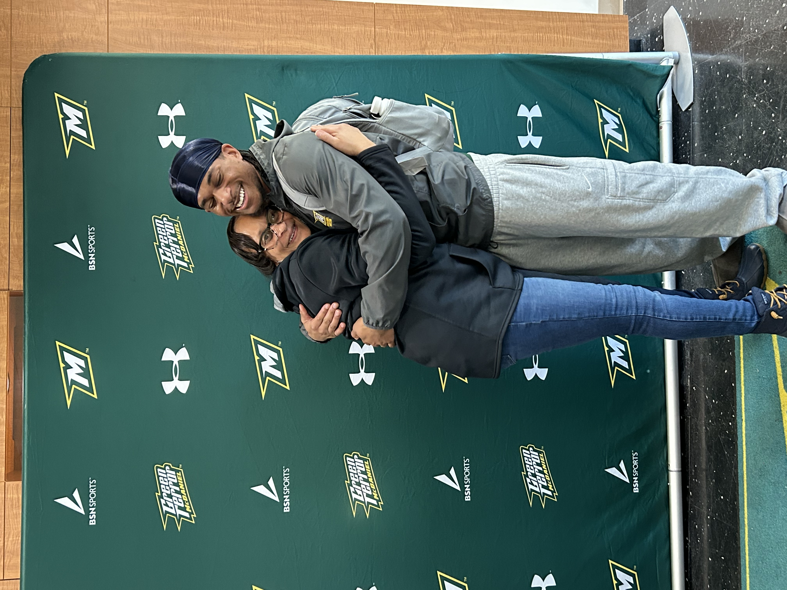
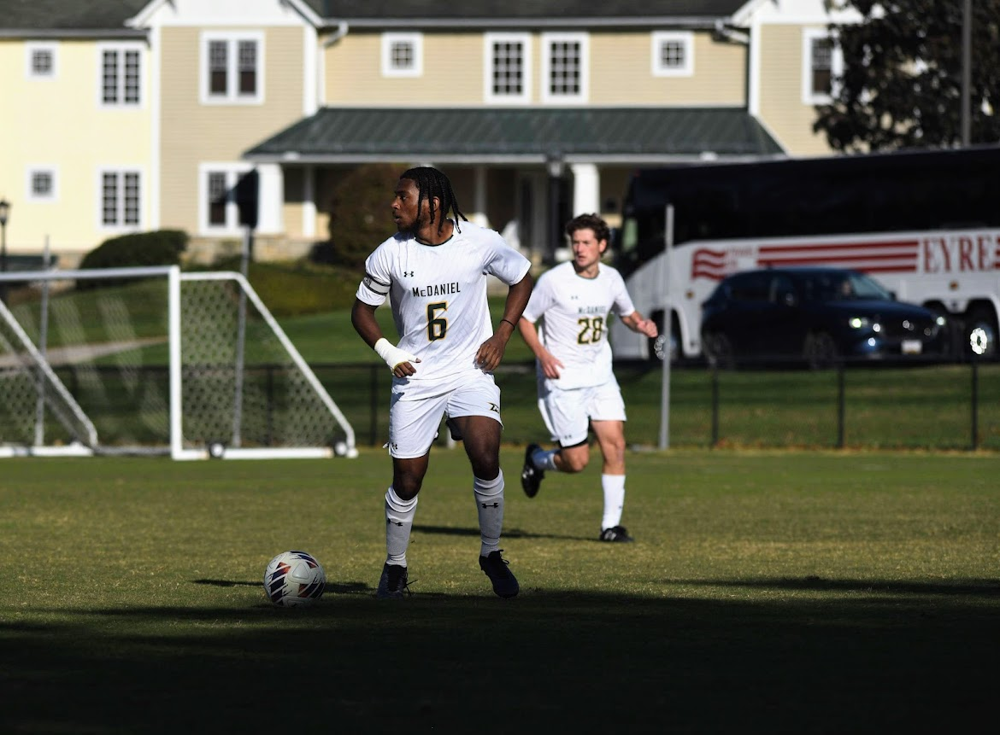
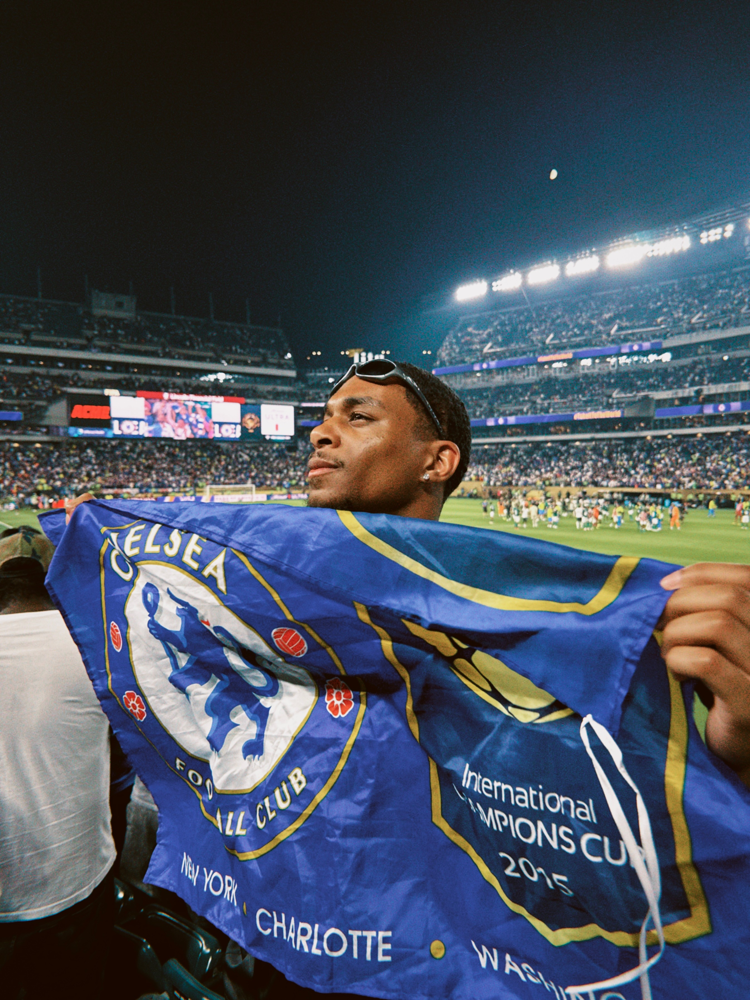

## Working with Jared Edge

## My Work Hours

I am more of a night owl, and it usually takes me a while to get going in the morning. As the day progresses, I tend to gain more energy and become increasingly productive. I find that my focus and creativity peak during the later hours, which is when I do my best work. This schedule allows me to tackle complex problems and think more clearly, especially when the environment is quieter and there are fewer distractions. While mornings can be a bit slow for me, I make up for it by staying engaged and active well into the evening.

## Communication

The best ways to reach me are either through email or text. I am usually pretty good at getting back to emails within a timely manner, as I check my inbox regularly throughout the day. However, when it comes to text messages, I tend to take a bit longer to respond. This is not because I am ignoring messages, but rather because I prefer to keep my phone on silent or do not disturb mode while I am working. If something is urgent, email is definitely the best way to get my attention quickly.

## What Makes Me Grumpy?

I tend to get frustrated when I get stuck on a problem or a line of code and can't figure out the error within the code. However, this challenge is also what contributes to why I enjoy working on my technical skills. There is a real sense of satisfaction and accomplishment when I finally resolve a problem that I have been stuck on for a while. The process of debugging and troubleshooting, although sometimes grumpy-inducing, is ultimately rewarding and helps me grow as a developer.

## How Do I Like to Receive Feedback?

I appreciate straightforward and direct feedback. I need to know exactly what the issue was with my work and what I need to do to improve it. Hints or a push in the right direction to solve the issue are also helpful, as they guide me without giving away the entire solution. Constructive criticism is always welcome, as it helps me learn and develop my skills further.

## One of My Goals for the Coming Year

One of my main goals for the coming year is to scale my digital agency by obtaining more clients and really profiting from the services I provide. Additionally, I want to be employed full-time within the next 6-8 months to help fund my agency better than how it is getting funded right now. Achieving these goals will allow me to grow professionally and provide better services to my clients.

## Personal Projects
Created a gas station finder app using AI for my senior capstone
Created a portfolio website using HTML, JS, and CSS
Started a Digital Agency that works with small busniesses and scaling businesses

## Topics I’m Always Happy to Talk About

I am always happy to talk about AI. Artificial intelligence really fascinates me, from prompt engineering to understanding how AI works behind the scenes. Anything technical that can help me with my skills or any information that can help me become a better developer is always welcome. I am also interested in discussing up-and-coming breakthroughs in the industry. I believe it is very important to stay up to date with all the new developments in the tech world, as this knowledge can provide a competitive edge and inspire new ideas.

## Other Interesting Facts

- My favorite food is salmon.
- The video game I have the most hours on is Genshin Impact.
- My favorite sport is soccer  
  

