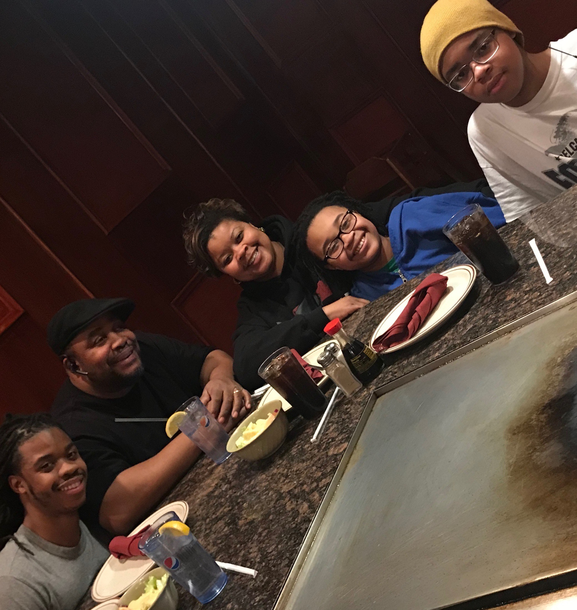

## Introduction
Kerry Ferguson is a recent graduate from the University of Delaware with a BA in Computer Science. He hopes to gain more experience, get a good job, and continue doing what he loves while supporting his loved ones.

## Work Hours
I work on a 9-5 schedule on weekdays. I'm a night owl, so I do my work later in the day on weekends. 

## Likes 
* Coffee. Give me some creamer and sugar and I'm good to go for a couple hours.
* Music. I'm not picky with genres, as long as I'm not working in complete silence.
* Space. Unless needed by someone, I prefer to stay in my own bubble when working.
* Chocolate. The cravings must be satiated.

Here are some of my more general interests (I'm always available to talk about hobbies!):
* Games
* Drawing 
* Reading

## Dislikes 
* Lack of structure. I like to be organized, and a lack of structure causes a drop of quality in my work.
* Sudden changes of plans (without good reason)
* Getting talked over/interrupted in conversations

## How do I learn?
I'm mainly a visual learner. I like to quietly observe while taking mental (and physical) notes. I'm not the most talkative person, but I am still actively engaged and participating when learning and conversing with others. I also enjoy helping others, which reinforces what I've learned.

## How do I like to give feedback?
When it comes to giving feedback, I prefer to have a conversation (in person or virtual) while writing notes. This ensures that everything is understood properly, and that the feedback can be reviewed at a later time. 

## How do I like to receive feedback?
When it comes to receiving feedback, I prefer the same methods as when I am giving feedback to someone. I would prefer to be emailed notes rather than using Google Chat. 

## What’s the best way to communicate with me?
If we can't talk in person, then Google Chat or email is fine! Having headphones in is usually a sign that I'm hard at work, but I don't mind being interrupted to talk!

## Goal for the coming year:
I want to become more proficient in how I think about coding. I want to increase my proficiency at writing code as well. 

## Fun facts:
* My birthday: 03/15
* My hometown: New Castle, DE
* Favorite Color: Green

