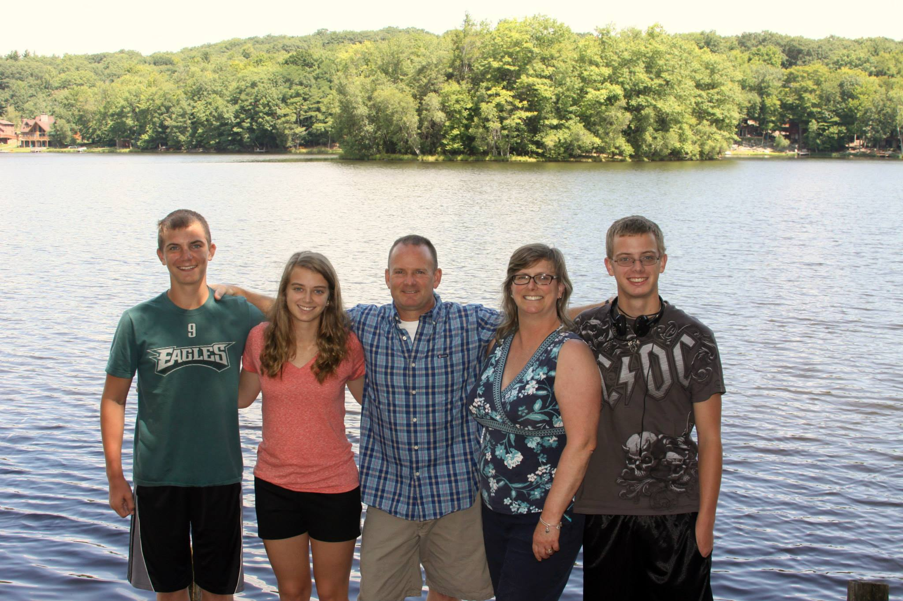
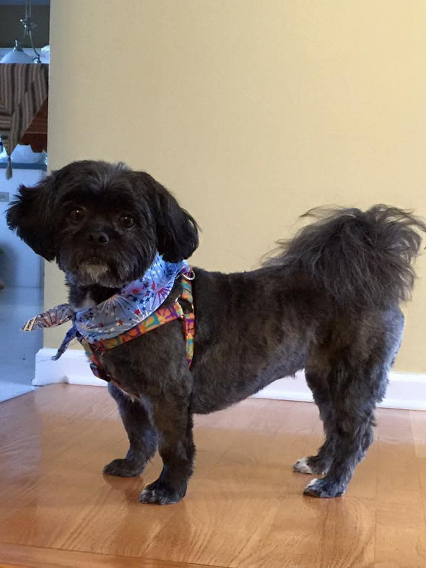

# Thomas Boyle README

## Introduction

I am an avid computer user who takes a great pleasure in learning new technologies around myself. I have a social disorder that while it affects his abilities to ascertain social connections, it does not stop me from achieving my goals. I play a plethora of different video games and wishes to create an AI that can interact with its user and openly interact with anything on the digital display simultaneously.

## Informal Work Habits And Necessities

Here are some of the things I need to be anything remotely productive in day-to-day life:

* Multiple different backgrounds from different origins
* Multiple sources of caffeine throughout the day
* Big into techno and EDM music in which it helps to keep me motivated and driven to complete any tasks given.
* I am an around the clock, open to any work or challenge. Anything that can be planned will not be missed and my schedule will shift as need be or required.
* I can be given any task as long as I can snack and have caffeine readily available, and go until completion.

## Important Working Habits Of Thomas

1. Works hard and only has to do something once right
2. Goes until said job or deadline is met
3. Stays on a one track mindset until given job is done
4. Not the best at multitasking
5. Ensures that a jobs completion is in tune with the job giver's requirements

## Find Me Or Contact Me

* One of the easiest ways to get into contact or find me is through text messaging. I do not often use social media for anything else but for personal reasons and following and liking creators of my personal interests.
  
## Things To Know About Me

* I am an avid anime watcher with 200+ animes watched.
* Although I don't tend to be a master of any video games, I do love the thrill of getting better as time goes on and enjoying the thrill of others great creations.
* I've had the reset button hit on my life when I was 11 years old due to unknown medical issues at the time.
* I have a medical condition that occasionally puts me out of commission for a day or more called hemiplegic migraines that sometimes leads to hospitalization.

## Photo Gallery
* This is my family

