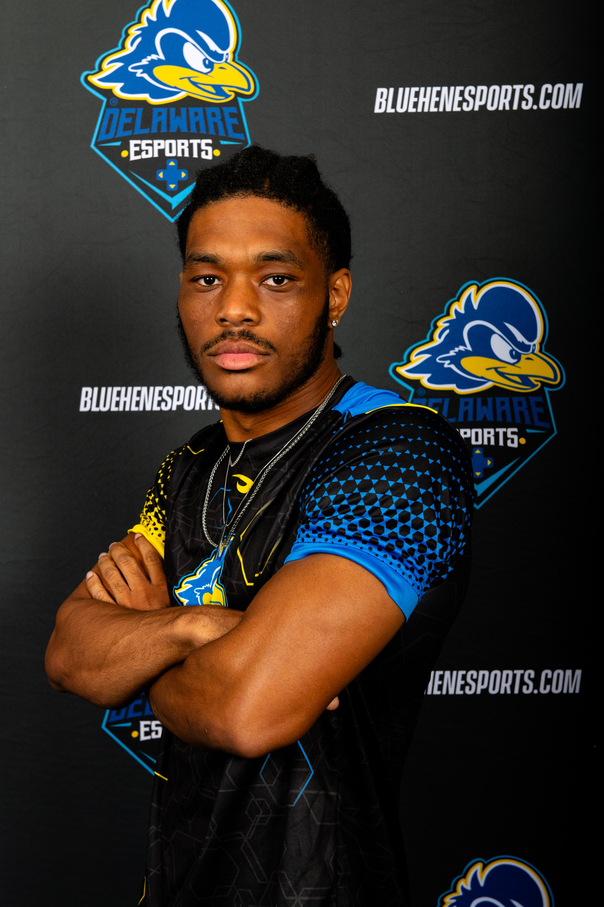

# 💫 Hey! Welcome To My GitHub!                                                                               

I am a software engineer and game developer with a passion for artificial intelligence, gamification, and anything related to space!

I graduated from the University of Delaware with a major in Computer Science and a minor in Mathematics, earning a cumulative GPA of 3.5. Throughout college, I held several leadership roles, including Resident Assistant, co-founder and president of the campus Game Development Club, team leader in the Esports program, and participant in a freshman leadership program. I also competed in multiple hackathons and game jams, earning over $2,000 in awards for my contributions and innovation.

# Fun Facts About Me

* I love playing active sports and games such as football and track-and-field
* I used to play Esports for my college. I competeted in Overwatch 1 and also Overwatch 2 as a tank main
* I am a fan of space and the openness/expansiveness of it. The amount of potential space has amazes me
* I also have experience teaching and tutoring students on multiple subjects, including math and computer science
* I also play chess on my freetime on Chess.com. Feel free to play against me, I am rated 1100 rapid

*Let’s build something meaningful and make an impact on the world!*

# My Tech Stack

I prefer coding in C#, Python, and Typescript, but I can also use similar languages in regards like Java, Javascript and others. These main 3 coding languages cover a good basis of what things I like to create and develop. They will be listed below in order:

1. Game Development: C# and Unity
1. AI & Machine Learning: Python, PyTorch and TensorFlow
1. Full Stack Development: Typescript & Javascript, React, Angular and Vue

I also made different variations of these tech stacks, such as a game using Python and a Python library that allowed GUIs. In general, I like app, game, and web development and the act of creating something, even if its in turns of artificial intelligence!

# Some Pictures Of Me
</a>
</a>

## 🌐 Socials:

To mainly contact you, you can reach me through email, tvrice252@gmail.com or LinkedIn. You can not reach me by number. I accept and read all emails everyday between 9am - 9pm.

 