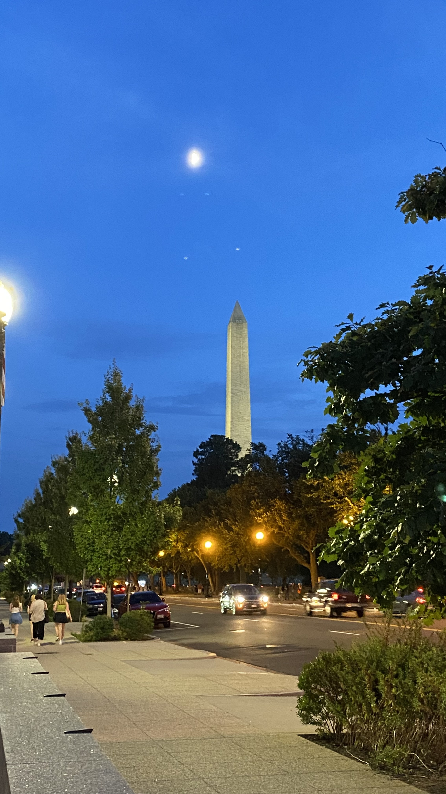

# Wayleom Vargas Rubio README

## Introduction
My name is Wayleom Vargas Rubio. I grew up in the Bronx from New York city. I moved to Delaware in my junior year of high school and graduated from Delaware State University. I majored in Information Technology and have a love for reading scientific articles.

## My work hours
I am not a morning person but have the ability to wake up early when needed. For a normal scheduled weekday when I have to work, I can be contacted starting at 9am. Throughout the day I should be reachable and I keep myself open until 6pm. During the weekends I am unavailable unless discussed with prior.

## Best way to communicate with me
I prefer to communicate with anyone through google chat or discord. For longer messages or documents please use my email. If I am working with a group on something important I prefer to be contacted over sms.

## How do I give feedback
I give my feedback straight and to the point. I will try to be considerate.

## How I prefer my feedback
I prefer my feed back straight to the point, if there are areas I need to improve let me know immediately.

## Topics I like to talk about
I like to talk about technology, science, video games, and tv shows. If anyone has some interests they want to share with my, I would be happy to listen.

## Goals
I aspire to become a Cybersecurity Professional on the Blue Team. I also want to learn new technologies to keep myself more relevant within my field. The first step in my career is to receive proper certifications such as the Security+, CySA+ , Red Hat, and PenTest+. The end goal is to be a Cloud Security Engineer or CTO if possible. I also want to set up my homelab this month to practice my skills.

## Photos

