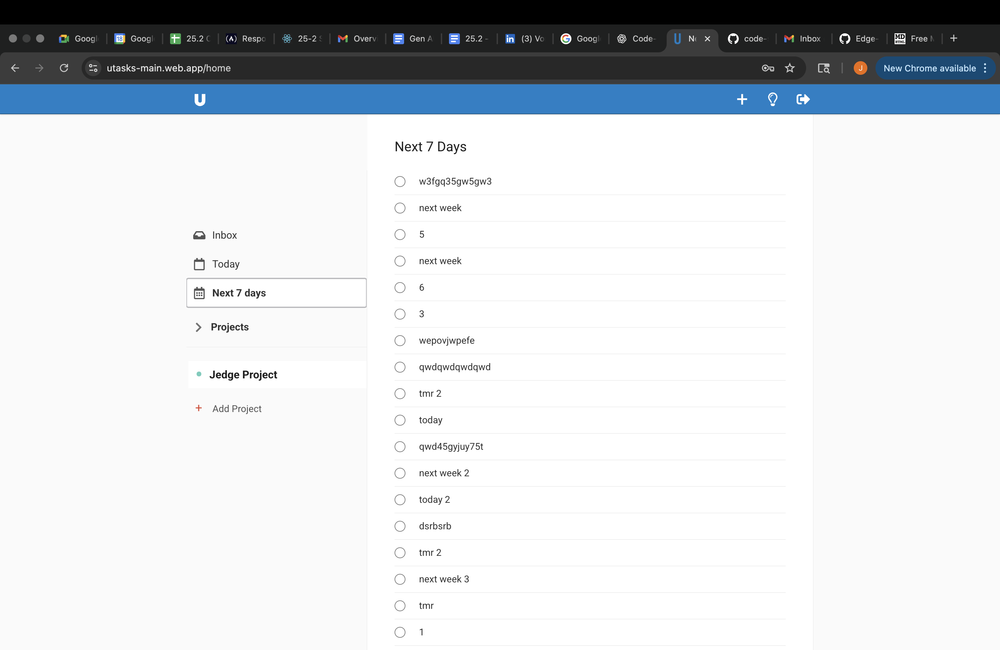
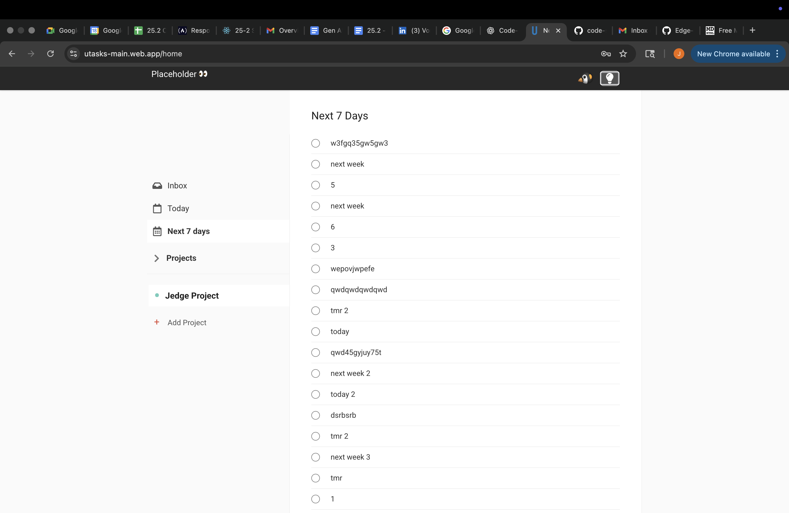
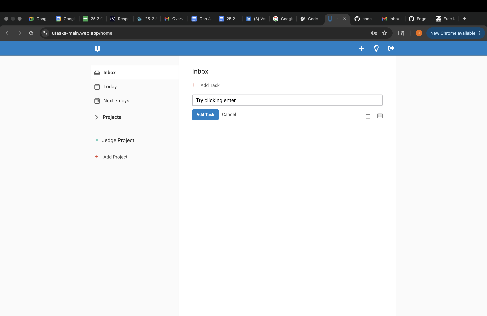

# Lesson 05 — Bug Reports

## Bug 1 — No visual feedback when marking task complete
**Environment:** macOS 14.5 / Chrome 126 / UTasks  

**Steps to Reproduce:**
1. Log in and add a new task “Test Task”.
2. Click the empty circle next to the task.
3. Click elsewhere on the screen.

**Expected Result:**  
- Clicking the circle should immediately show completion feedback:  
  - Circle fills or checkmark appears.  
  - Task text changes style (strike-through or dim).  
  - Task disappears if “Active” filter is applied.  

**Actual Result:**  
- Task remains unchanged visually after clicking the circle.  
- It only disappears after clicking elsewhere on the site and returning to the original screen.  
- No immediate indication that completion happened.  

**Evidence:**   

**Severity:** Medium  
 

---

## Bug 2 — Lightbulb icon causes placeholder text and misaligned button
**Environment:** macOS 14.5 / Chrome 126 / UTasks  

**Steps to Reproduce:**
1. Log in to UTasks.  
2. Click the lightbulb icon in the top right.  

**Expected Result:**  
- Theme/icon change should not break layout.  
- Page should not display developer placeholder text.  
- The “Add Task” button should remain in a consistent location.  

**Actual Result:**  
- “place holder” text appears at the top of the page.  
- The “Add Task” button shifts location.  

**Evidence:** 
  

**Severity:** Low–Medium  
  

---

## Bug 3 — Pressing Enter in Add Task field does nothing
**Environment:** macOS 14.5 / Chrome 126 / UTasks  

**Steps to Reproduce:**
1. Log in.  
2. Focus the Add Task input.  
3. Type a task title (e.g., “Test Enter”).  
4. Press **Enter**.  

**Expected Result:**  
- Task should be created immediately (same as clicking “Add Task”).  

**Actual Result:**  
- Nothing happens; task not created.  

**Evidence:**  

**Severity:** Low  
 

---

## Bug 4 — Pressing Enter on login clears fields instead of submitting
**Environment:** macOS 14.5 / Chrome 126 / UTasks  

**Steps to Reproduce:**
1. Navigate to login page.  
2. Enter valid username + password.  
3. Press **Enter**.  

**Expected Result:**  
- Form should submit and log the user in.  

**Actual Result:**  
- Fields are cleared.  
- Login only works by clicking the “Login” button.  

**Evidence:** [Clickiing enter in the login field](./images/enter_login.png)  

**Severity:** Low 
 

---

## Bug 5 — Tasks appear in inconsistent order
**Environment:** macOS 14.5 / Chrome 126 / UTasks  

**Steps to Reproduce:**
1. Log in.  
2. Create three tasks:  
   - “Today” with due date today  
   - “Tmr” with due date tomorrow  
   - “Next Week” with due date in 7 days  
3. View the task list.  

**Expected Result:**  
- Tasks should be sorted consistently (by due date or creation).  

**Actual Result:**  
- Tasks appear in random/inconsistent order.  

**Evidence:** [Tasks have no prioity when added into the list](./images/task_order.png)

**Severity:** Medium–High  
 
