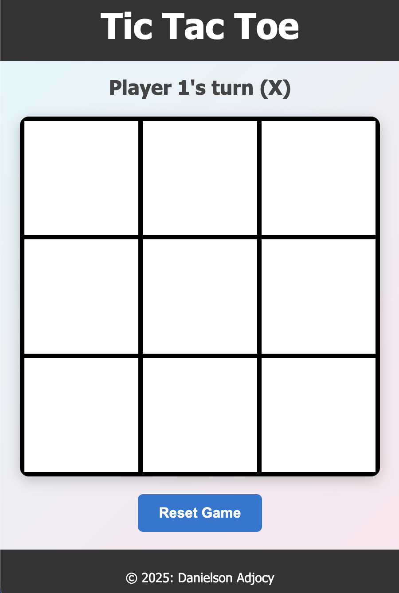

# Tic Tac Toe Game

This creates a Tic Tac Toe game where two players can take turns marking boxes and trying to get three of there symbols in a row.

## Features

- **Interactive Game Board**: Clickable cells for easy gameplay.
- **Player Turn Indicator**: Displays whose turn it is.
- **Winner Announcement**: Declares the winner or a draw when the game ends.
- **Reset Button**: Allows players to reset the game and start over.

## Game

## How to Play

1. Player 1 (X) starts the game.
3. Players take turns clicking on the cells to place their symbol (X or O).
4. The game ends when:
   - A player aligns three symbols in a row, column, or diagonal.
   - All cells are filled, resulting in a draw.
5. Click the "Reset Game" button to restart the game.